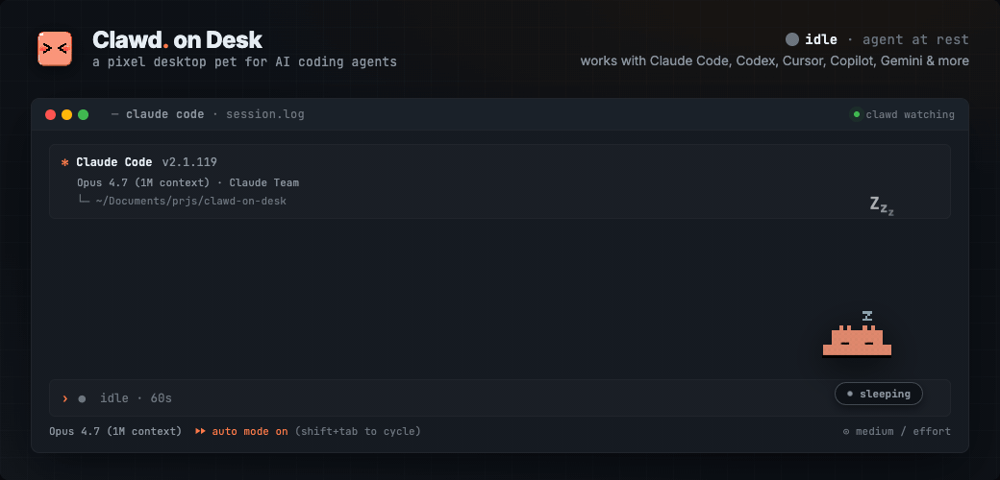
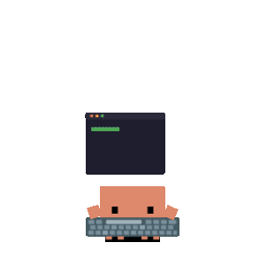
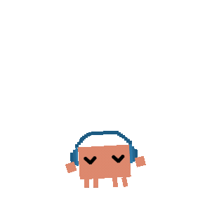
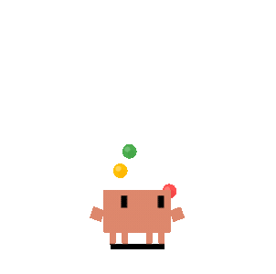
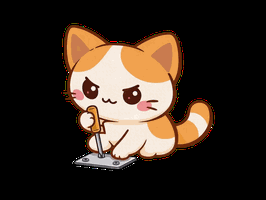
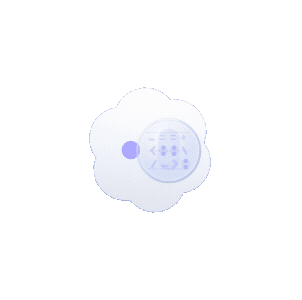
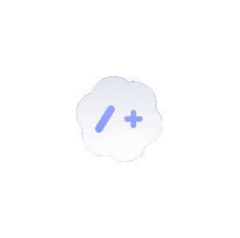
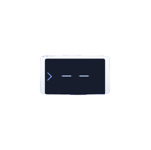
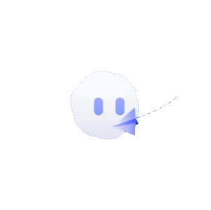

<p align="center">
  
</p>
<h1 align="center">Duck on Desk</h1>

> **duck-on-desk** is an AGPL-3.0 derivative of [Clawd on Desk](https://github.com/rullerzhou-afk/clawd-on-desk) (baseline commit `5ca26b5c`) that swaps the pixel crab for a physics-driven 3D Microduck. See `NOTICE.md`.

<p align="center">
  <a href="README.zh-CN.md">中文版</a>
</p>
<p align="center">
  <sub>🌏 Don't see your language? <a href="https://github.com/rullerzhou-afk/duck-on-desk/pulls">Open a PR</a> to add one — Français, Deutsch, etc. all welcome.</sub>
</p>
<p align="center">
  <a href="https://github.com/rullerzhou-afk/duck-on-desk/releases"></a>
  
</p>
<p align="center">
  <a href="https://github.com/rullerzhou-afk/duck-on-desk/stargazers"></a>
  <a href="https://github.com/hesreallyhim/awesome-claude-code"></a>
</p>

<p align="center">
  
</p>

Duck lives on your desktop and reacts to what your AI coding agent is doing — in real time. Start a long task, walk away, come back when the crab tells you it's done.

Thinking when you prompt, typing when tools run, grooving or juggling for subagents, reviewing permissions, celebrating when tasks complete, sleeping when you step away. Ships with three built-in themes: **Duck** (pixel crab), **Calico** (三花猫), and **Cloudling** (云宝), with full support for custom themes and imported Codex Pet animation packs.

> Supports Windows 11, macOS, and Ubuntu/Linux. Windows releases provide separate x64 and ARM64 installers. Source builds require Node.js. Works with **Claude Code**, **Codex CLI**, **CodeBuddy**, **WorkBuddy**, **opencode**, and **Pi**.

## Features

### Multi-Agent Support
- **Claude Code** — full integration via command hooks + HTTP permission hooks
- **Codex CLI** — official hooks with JSONL fallback (`~/.codex/sessions/`), auto-synced by default with real permission bubbles
- **CodeBuddy** — optional Claude Code-compatible command hooks + HTTP permission hooks via `~/.codebuddy/settings.json` (install from Settings → Agents or run `node hooks/codebuddy-install.js`)
- **Custom HTTP agents** — register another local executable in Settings and POST lifecycle events to Duck's dynamic `/state` endpoint. Registration does not install hooks or make an arbitrary application report automatically; v1 is state-only and leaves permission decisions in the application's own UI. See the [custom HTTP agent guide](docs/guides/custom-agent-http.md).
- **WorkBuddy** — optional Claude Code-compatible command hooks via `~/.workbuddy-ai/settings.json` (current) or `~/.workbuddy/settings.json` (legacy; install from Settings → Agents or run `node hooks/workbuddy-install.js`). State + Notification only: the desktop app resolves permissions in its own native sandbox and GUI, so Duck does not register a permission hook for it.
- **opencode** — optional [plugin integration](https://opencode.ai/docs/plugins) via the effective file under `~/.config/opencode/` (`config.json` → `opencode.json` → `opencode.jsonc`, later wins) (install from Settings → Agents or run `node hooks/opencode-install.js`); zero-latency event streaming and permission bubbles with Allow/Always/Deny. Child sessions spawned by the `task` tool are headless and do not participate in the visible multi-session animation fanout
- **Pi** — optional global extension via `~/.pi/agent/extensions/duck-on-desk` (install from Settings → Agents or run `npm run install:pi-extension`); state-only interactive lifecycle and tool activity updates while preserving Pi's default YOLO behavior
- **Multi-agent coexistence** — run all agents simultaneously; Duck tracks each session independently

### Animations & Interaction
- **Real-time state awareness** — agent hooks and log polling drive Duck's animations automatically
- **12 animated states** — idle, thinking, typing, building, subagent groove, multi-subagent juggling, error, happy, notification, sweeping, carrying, sleeping
- **Codex Pet imports** — import Codex Pet zip packages from `Settings…` → `Theme`; Duck adapts their atlas animations into managed themes
- **Eye tracking** — Duck follows your cursor in idle state, with body lean and shadow stretch
- **Sleep sequence** — yawning, dozing, collapsing, sleeping after 60s idle; mouse movement triggers a startled wake-up animation
- **Click reactions** — double-click for a poke, 4 clicks for a flail
- **Drag from any state** — grab Duck anytime (Pointer Capture prevents fast-flick drops), release to resume
- **Mini mode** — drag to right edge or right-click "Mini Mode"; Duck hides at screen edge with peek-on-hover, mini alerts/celebrations, and parabolic jump transitions

### Permission Bubble
- **In-app permission review** — when a permission-capable integration sends a supported request, Duck can pop a floating bubble card instead of waiting in the terminal; state-only agents keep their native permission flow
- **Allow / deny / agent-native extras** — one-click approve or reject, plus permission rules / `Always` actions when the source agent supports them
- **Permission handling modes** — choose **Ask every time**, confirmation-gated **Question prompts only** (tool-shaped requests from explicitly supported agents), or **Auto-approve**. Auto-approve handles every request the adapter marks automation-eligible—including unrecognized non-empty Claude request names—but missing names, unsupported decision shapes, and CodeBuddy questions/plans still defer to the native flow. It downgrades after restart, and each eligible live session can independently choose Ask every time or tools-only. See the [setup guide](docs/guides/setup-guide.md#permission-handling-automation)
- **Global hotkeys** — `Ctrl+Shift+Y` to Allow, `Ctrl+Shift+N` to Deny the latest permission bubble (only registered while bubbles are visible)
- **Stacking layout** — multiple permission requests stack upward from the bottom-right corner
- **Auto-dismiss** — if you answer in the terminal first, the bubble disappears automatically
- **Per-agent toggle** — open `Settings…` → `Agents`, pick an agent, and turn off `Show pop-up bubbles` to keep prompts in that agent's own terminal/TUI

### Session Intelligence
- **Multi-session tracking** — sessions across all agents resolve to the highest-priority state
- **Subagent awareness** — headphones groove for 1 subagent, three-ball juggling for 2+
- **Sessions dashboard + HUD** — right-click or tray → `Open Dashboard` to inspect live sessions, recent events, aliases, and jump to a terminal; a compact HUD near Duck keeps current live sessions visible
- **Private local recap** — `Settings → Recap` (or right-click → `Open Recap`) reviews accepted agent activity by hour/day for today, week, month, or year. It distinguishes unsupported metrics from zero and uncovered time from quiet time, keeps DND activity, stores only minimized local data, and adds no telemetry, export, sharing, token, cost, duration, streak, or productivity score. See the [recap guide](docs/guides/recap.md).
- **Subscription quota at a glance** — optional Orbit rings beside the pet and detailed Dashboard bars show the quota windows reported by supported agents. Local Claude collection is off by default and uses Claude Code's [official status-line `rate_limits` payload](https://code.claude.com/docs/en/statusline); it does not make an additional request to Anthropic. See the [data-flow and ownership notes](docs/guides/setup-guide.md#claude-code-subscription-quota-official-status-line-not-scraping).
- **Terminal focus** — Dashboard/HUD actions jump to a specific session's terminal window; notification/attention states auto-focus the relevant terminal
- **Process liveness detection** — detects crashed/exited supported agent processes and cleans up orphan sessions
- **Startup recovery** — if Duck restarts while any supported agent is still running, it stays awake instead of falling asleep

### Mobile Companion (PWA)
- **Live mirror on your phone** — enable `Settings…` → `Mobile / PWA` and open the pairing URL on your phone; the Duck Mobile web app shows your agent sessions and their live states in real time
- **Read-only by design** — the LAN bridge only broadcasts state; nothing in the PWA can touch your machine (LAN PWA approval is on the roadmap)
- **LAN-only + token-gated** — pairing requires a token, tokens rotate automatically with a grace window, and access can be regenerated or reset in one click
- **Installable** — it's a PWA: add it to your home screen for an app-like experience
> The mobile companion line — from the first prototype to token rotation — is built and led by core contributor [@Bynlk](https://github.com/Bynlk), who also maintains [duck-on-mobile](https://github.com/Bynlk/duck-on-mobile), a sister fork with a native Android app.

### System
- **Click-through** — transparent areas pass clicks to windows below; only Duck's body is interactive
- **Position memory** — Duck remembers where you left it across restarts (including mini mode)
- **Single instance lock** — prevents duplicate Duck windows
- **Auto-start** — Claude Code's SessionStart hook can launch Duck automatically if it's not running
- **Do Not Disturb** — right-click or tray menu to enter sleep mode; the pet stops reacting until you wake Duck. DND suppresses things that ask you to act, not status. Permission bubbles are suppressed during DND — Codex and opencode fall back to their native prompts, while Claude Code and CodeBuddy fall back to their built-in permission flow. WorkBuddy uses state + Notification only; Pi is a state-only integration.
- **Sound effects** — short audio cues on task completion and permission requests (toggle via the system tray or Settings; 10s cooldown, auto-muted during DND)
- **System tray** — DND mode, auto-start, check for updates
- **i18n** — English, Simplified Chinese, Traditional Chinese, Korean, Japanese, Brazilian Portuguese, and Spanish UI; switch in Settings → General
- **Auto-update** — checks GitHub releases; Windows installs NSIS updates on quit, macOS/Linux `git pull` + restart when running from a cloned repo

## Animations

<table>
  <tr>
    <td align="center"><br><sub>Idle</sub></td>
    <td align="center"><br><sub>Thought Bubble</sub></td>
    <td align="center"><br><sub>Typing</sub></td>
    <td align="center"><br><sub>Building</sub></td>
    <td align="center"><br><sub>1 Subagent</sub></td>
    <td align="center"><br><sub>2+ Subagents</sub></td>
  </tr>
  <tr>
    <td align="center"><br><sub>Calico Idle</sub></td>
    <td align="center"><br><sub>Calico Thinking</sub></td>
    <td align="center"><br><sub>Calico Typing</sub></td>
    <td align="center"><br><sub>Calico Building</sub></td>
    <td align="center"><br><sub>Calico Juggling</sub></td>
    <td align="center"><br><sub>Calico Conducting</sub></td>
  </tr>
  <tr>
    <td align="center"><br><sub>Cloudling Idle</sub></td>
    <td align="center"><br><sub>Cloudling Thinking</sub></td>
    <td align="center"><br><sub>Cloudling Typing</sub></td>
    <td align="center"><br><sub>Cloudling Building</sub></td>
    <td align="center"><br><sub>Cloudling Juggling</sub></td>
    <td align="center"><br><sub>Cloudling Conducting</sub></td>
  </tr>
</table>

Full event-to-state mapping, mini mode, and click reactions: **[docs/guides/state-mapping.md](docs/guides/state-mapping.md)**

## Multi-display

Duck adapts to multi-monitor setups: proportional sizing uses the display Duck launches on, portrait monitors get a bounded boost so the pet stays readable on tall narrow screens, and you can drag Duck across displays.

<p align="center"><sub>Want to see the real multi-monitor behavior? <a href="assets/videos/duck-multi-monitor-demo.mp4">Watch the demo video in this repository</a>.</sub></p>

## Quick Start

For normal use, download the latest prebuilt installer from **[GitHub Releases](https://github.com/rullerzhou-afk/duck-on-desk/releases/latest)**:

- **Windows**: `Duck-on-Desk-Setup-<version>-x64.exe` or `Duck-on-Desk-Setup-<version>-arm64.exe`
- **macOS**: `.dmg`
- **Linux**: `.AppImage` or `.deb`

Launch Duck after installing it. Fresh installs auto-sync Claude Code and Codex only; install other local agent integrations from **Settings → Agents** when you need them.

Run from source only if you're contributing, testing unreleased code, or debugging integrations. Source installs download Electron/build tooling and can create a large `node_modules` tree.

```bash
# Clone the repo
git clone https://github.com/rullerzhou-afk/duck-on-desk.git
cd duck-on-desk

# Install dependencies
npm install

# Start Duck (auto-registers Claude Code and Codex hooks on launch)
npm start
```

**Claude Code** and **Codex CLI** work out of the box with auto-registered hooks. For **CodeBuddy**, **WorkBuddy**, **opencode**, and **Pi**, install the integration from **Settings → Agents** first; Duck then keeps it synced while it remains enabled. Also covers WSL and platform-specific notes (macOS / Linux): **[docs/guides/setup-guide.md](docs/guides/setup-guide.md)**

## Known Limitations

Some agents have feature gaps (no permission bubble, polling latency, no terminal focus). See the full table: **[docs/guides/known-limitations.md](docs/guides/known-limitations.md)**

## Custom Themes

Duck supports custom themes — replace the default crab with your own character and animations. If you already have a Codex Pet package, import its zip from `Settings…` → `Theme` → `Import pet zip`; Duck turns the atlas into a managed theme automatically.

**Quick start:**
1. Scaffold a theme:
   ```bash
   node scripts/create-theme.js my-theme
   # or
   npm run create-theme -- my-theme
   ```
   No argument also works: it creates the next available `my-theme` scaffold in your user themes directory.
2. Edit `theme.json` and create your assets (SVG, GIF, APNG, WebP, PNG, JPG, or JPEG)
3. Restart Duck or open `Settings…` → `Theme` → select your theme

**Minimum viable theme:** 1 SVG (idle with eye tracking) + 7 GIF/APNG files (thinking, working, error, happy, notification, sleeping, waking). Eye tracking can be disabled to use any format for all states.

Validate your theme before distributing:
```bash
node scripts/validate-theme.js path/to/your-theme
```

Theme cards in `Settings…` → `Theme` now expose capability badges such as `Tracked idle`, `Static theme`, `Mini`, `Direct sleep`, and `No reactions`, so users can tell what a theme supports before switching.

See [docs/guides/guide-theme-creation.md](docs/guides/guide-theme-creation.md) for the full creation guide with tiered paths (beginner → advanced), `theme.json` field reference, and asset guidelines.

> Third-party SVG files are automatically sanitized for security.

### Roadmap

Some things we'd like to explore in the future:

- Codex terminal focus via process tree lookup from `codex.exe` PID
- Theme registry and in-app download
- Hook uninstall script for clean app removal
- LAN PWA mobile companion: in-browser permission approval (in progress, led by [@Bynlk](https://github.com/Bynlk))

## Contributing

Duck on Desk is a community-driven project. Bug reports, feature ideas, and pull requests are all welcome — open an [issue](https://github.com/rullerzhou-afk/duck-on-desk/issues) to discuss or submit a PR directly.

### Maintainers

<table>
  <tr>
    <td align="center" valign="top" width="140"><a href="https://github.com/rullerzhou-afk"><br /><sub><b>@rullerzhou-afk</b><br />鹿鹿 · creator</sub></a></td>
    <td align="center" valign="top" width="140"><a href="https://github.com/YOIMIYA66"><br /><sub><b>@YOIMIYA66</b><br />maintainer</sub></a></td>
    <td align="center" valign="top" width="140"><a href="https://github.com/Bynlk"><br /><sub><b>@Bynlk</b><br />core contributor · Mobile / PWA</sub></a></td>
  </tr>
</table>

### Contributors

Thanks to everyone who has helped make Duck better:

<table>
  <tr>
    <td align="center" valign="top" width="110"><a href="https://github.com/PixelCookie-zyf"><br /><sub>PixelCookie-zyf</sub></a></td>
    <td align="center" valign="top" width="110"><a href="https://github.com/yujiachen-y"><br /><sub>yujiachen-y</sub></a></td>
    <td align="center" valign="top" width="110"><a href="https://github.com/AooooooZzzz"><br /><sub>AooooooZzzz</sub></a></td>
    <td align="center" valign="top" width="110"><a href="https://github.com/purefkh"><br /><sub>purefkh</sub></a></td>
    <td align="center" valign="top" width="110"><a href="https://github.com/Tobeabellwether"><br /><sub>Tobeabellwether</sub></a></td>
    <td align="center" valign="top" width="110"><a href="https://github.com/Jasonhonghh"><br /><sub>Jasonhonghh</sub></a></td>
    <td align="center" valign="top" width="110"><a href="https://github.com/crashchen"><br /><sub>crashchen</sub></a></td>
  </tr>
  <tr>
    <td align="center" valign="top" width="110"><a href="https://github.com/hongbigtou"><br /><sub>hongbigtou</sub></a></td>
    <td align="center" valign="top" width="110"><a href="https://github.com/InTimmyDate"><br /><sub>InTimmyDate</sub></a></td>
    <td align="center" valign="top" width="110"><a href="https://github.com/NeizhiTouhu"><br /><sub>NeizhiTouhu</sub></a></td>
    <td align="center" valign="top" width="110"><a href="https://github.com/xu3stones-cmd"><br /><sub>xu3stones-cmd</sub></a></td>
    <td align="center" valign="top" width="110"><a href="https://github.com/androidZzT"><br /><sub>androidZzT</sub></a></td>
    <td align="center" valign="top" width="110"><a href="https://github.com/Ye-0413"><br /><sub>Ye-0413</sub></a></td>
    <td align="center" valign="top" width="110"><a href="https://github.com/WanfengzzZ"><br /><sub>WanfengzzZ</sub></a></td>
  </tr>
  <tr>
    <td align="center" valign="top" width="110"><a href="https://github.com/TaoXieSZ"><br /><sub>TaoXieSZ</sub></a></td>
    <td align="center" valign="top" width="110"><a href="https://github.com/ssly"><br /><sub>ssly</sub></a></td>
    <td align="center" valign="top" width="110"><a href="https://github.com/stickycandy"><br /><sub>stickycandy</sub></a></td>
    <td align="center" valign="top" width="110"><a href="https://github.com/Rladmsrl"><br /><sub>Rladmsrl</sub></a></td>
    <td align="center" valign="top" width="110"><a href="https://github.com/YOIMIYA66"><br /><sub>YOIMIYA66</sub></a></td>
    <td align="center" valign="top" width="110"><a href="https://github.com/Kevin7Qi"><br /><sub>Kevin7Qi</sub></a></td>
    <td align="center" valign="top" width="110"><a href="https://github.com/sefuzhou770801-hub"><br /><sub>sefuzhou770801-hub</sub></a></td>
  </tr>
  <tr>
    <td align="center" valign="top" width="110"><a href="https://github.com/Tonic-Jin"><br /><sub>Tonic-Jin</sub></a></td>
    <td align="center" valign="top" width="110"><a href="https://github.com/seoki180"><br /><sub>seoki180</sub></a></td>
    <td align="center" valign="top" width="110"><a href="https://github.com/sophie-haynes"><br /><sub>sophie-haynes</sub></a></td>
    <td align="center" valign="top" width="110"><a href="https://github.com/PeterShanxin"><br /><sub>PeterShanxin</sub></a></td>
    <td align="center" valign="top" width="110"><a href="https://github.com/CHIANGANGSTER"><br /><sub>CHIANGANGSTER</sub></a></td>
    <td align="center" valign="top" width="110"><a href="https://github.com/JaeHyeon-KAIST"><br /><sub>JaeHyeon-KAIST</sub></a></td>
    <td align="center" valign="top" width="110"><a href="https://github.com/hhhzxyhhh"><br /><sub>hhhzxyhhh</sub></a></td>
  </tr>
  <tr>
    <td align="center" valign="top" width="110"><a href="https://github.com/TVpoet"><br /><sub>TVpoet</sub></a></td>
    <td align="center" valign="top" width="110"><a href="https://github.com/zeus6768"><br /><sub>zeus6768</sub></a></td>
    <td align="center" valign="top" width="110"><a href="https://github.com/anhtrinh919"><br /><sub>anhtrinh919</sub></a></td>
    <td align="center" valign="top" width="110"><sub>tomaioo</sub></td>
    <td align="center" valign="top" width="110"><a href="https://github.com/v-avuso"><br /><sub>v-avuso</sub></a></td>
    <td align="center" valign="top" width="110"><a href="https://github.com/livlign"><br /><sub>livlign</sub></a></td>
    <td align="center" valign="top" width="110"><a href="https://github.com/tongguang2"><br /><sub>tongguang2</sub></a></td>
  </tr>
  <tr>
    <td align="center" valign="top" width="110"><a href="https://github.com/Ziy1-Tan"><br /><sub>Ziy1-Tan</sub></a></td>
    <td align="center" valign="top" width="110"><a href="https://github.com/tatsuyanakanogaroinc"><br /><sub>tatsuyanakanogaroinc</sub></a></td>
    <td align="center" valign="top" width="110"><a href="https://github.com/yeonhub"><br /><sub>yeonhub</sub></a></td>
    <td align="center" valign="top" width="110"><a href="https://github.com/joshua-wu"><br /><sub>joshua-wu</sub></a></td>
    <td align="center" valign="top" width="110"><a href="https://github.com/nmsn"><br /><sub>nmsn</sub></a></td>
    <td align="center" valign="top" width="110"><a href="https://github.com/sunnysonx"><br /><sub>sunnysonx</sub></a></td>
    <td align="center" valign="top" width="110"><a href="https://github.com/YuChenYunn"><br /><sub>YuChenYunn</sub></a></td>
  </tr>
  <tr>
    <td align="center" valign="top" width="110"><a href="https://github.com/jhseo-b"><br /><sub>jhseo-b</sub></a></td>
    <td align="center" valign="top" width="110"><a href="https://github.com/Hwasowl"><br /><sub>Hwasowl</sub></a></td>
    <td align="center" valign="top" width="110"><a href="https://github.com/XiangZheng2002"><br /><sub>XiangZheng2002</sub></a></td>
    <td align="center" valign="top" width="110"><a href="https://github.com/keiyo118"><br /><sub>keiyo118</sub></a></td>
    <td align="center" valign="top" width="110"><a href="https://github.com/pan93412"><br /><sub>pan93412</sub></a></td>
    <td align="center" valign="top" width="110"><a href="https://github.com/taehwanis"><br /><sub>taehwanis</sub></a></td>
    <td align="center" valign="top" width="110"><a href="https://github.com/linnin233"><br /><sub>linnin233</sub></a></td>
  </tr>
  <tr>
    <td align="center" valign="top" width="110"><a href="https://github.com/xiyouMc"><br /><sub>xiyouMc</sub></a></td>
    <td align="center" valign="top" width="110"><a href="https://github.com/Bynlk"><br /><sub>Bynlk</sub></a></td>
    <td align="center" valign="top" width="110"><a href="https://github.com/zxypro1"><br /><sub>zxypro1</sub></a></td>
    <td align="center" valign="top" width="110"><a href="https://github.com/NeroAyase"><br /><sub>NeroAyase</sub></a></td>
    <td align="center" valign="top" width="110"><a href="https://github.com/divergentD"><br /><sub>divergentD</sub></a></td>
    <td align="center" valign="top" width="110"><a href="https://github.com/Ne9roni"><br /><sub>Ne9roni</sub></a></td>
    <td align="center" valign="top" width="110"><a href="https://github.com/QingXB"><br /><sub>QingXB</sub></a></td>
  </tr>
  <tr>
    <td align="center" valign="top" width="110"><a href="https://github.com/29206394"><br /><sub>藤知</sub></a></td>
    <td align="center" valign="top" width="110"><a href="https://github.com/Tsdsj"><br /><sub>Tsdsj</sub></a></td>
    <td align="center" valign="top" width="110"><a href="https://github.com/godlockin"><br /><sub>godlockin</sub></a></td>
    <td align="center" valign="top" width="110"><a href="https://github.com/sLingli"><br /><sub>sLingli</sub></a></td>
    <td align="center" valign="top" width="110"><a href="https://github.com/ustin-star"><br /><sub>ustin-star</sub></a></td>
    <td align="center" valign="top" width="110"><a href="https://github.com/cod3hulk"><br /><sub>cod3hulk</sub></a></td>
    <td align="center" valign="top" width="110"><a href="https://github.com/lxgxhsy"><br /><sub>lxgxhsy</sub></a></td>
  </tr>
  <tr>
    <td align="center" valign="top" width="110"><a href="https://github.com/rebootcrab-blip"><br /><sub>rebootcrab-blip</sub></a></td>
    <td align="center" valign="top" width="110"><a href="https://github.com/zhaoxv210"><br /><sub>zhaoxv210</sub></a></td>
    <td align="center" valign="top" width="110"><a href="https://github.com/serenNan"><br /><sub>serenNan</sub></a></td>
    <td align="center" valign="top" width="110"><a href="https://github.com/IatomicreactorI"><br /><sub>IatomicreactorI</sub></a></td>
    <td align="center" valign="top" width="110"><a href="https://github.com/quantai1314"><br /><sub>quantai1314</sub></a></td>
    <td align="center" valign="top" width="110"><a href="https://github.com/Git-creat7"><br /><sub>Git-creat7</sub></a></td>
    <td align="center" valign="top" width="110"><a href="https://github.com/undownding"><br /><sub>undownding</sub></a></td>
  </tr>
  <tr>
    <td align="center" valign="top" width="110"><a href="https://github.com/chrono-meta"><br /><sub>chrono-meta</sub></a></td>
    <td align="center" valign="top" width="110"><a href="https://github.com/Yike-Ye"><br /><sub>Yike-Ye</sub></a></td>
    <td align="center" valign="top" width="110"><a href="https://github.com/xiaoshidefeng"><br /><sub>xiaoshidefeng</sub></a></td>
    <td align="center" valign="top" width="110"><a href="https://github.com/yanguibao1997"><br /><sub>yanguibao1997</sub></a></td>
    <td align="center" valign="top" width="110"><a href="https://github.com/JasonZH6600"><br /><sub>JasonZH6600</sub></a></td>
    <td align="center" valign="top" width="110"><a href="https://github.com/V1staz"><br /><sub>V1staz</sub></a></td>
    <td align="center" valign="top" width="110"><a href="https://github.com/royhuang91"><br /><sub>royhuang91</sub></a></td>
  </tr>
  <tr>
    <td align="center" valign="top" width="110"><a href="https://github.com/Schlaflied"><br /><sub>Schlaflied</sub></a></td>
    <td align="center" valign="top" width="110"><a href="https://github.com/KaiC5504"><br /><sub>KaiC5504</sub></a></td>
    <td align="center" valign="top" width="110"><a href="https://github.com/jiaxuan1101"><br /><sub>jiaxuan1101</sub></a></td>
    <td align="center" valign="top" width="110"><a href="https://github.com/kkirito16"><br /><sub>kkirito16</sub></a></td>
    <td align="center" valign="top" width="110"><a href="https://github.com/200780381"><br /><sub>200780381</sub></a></td>
    <td align="center" valign="top" width="110"><a href="https://github.com/Dxy2326"><br /><sub>Dxy2326</sub></a></td>
    <td align="center" valign="top" width="110"><a href="https://github.com/lurui1997"><br /><sub>lurui1997</sub></a></td>
  </tr>
  <tr>
    <td align="center" valign="top" width="110"><a href="https://github.com/JesmonX"><br /><sub>JesmonX</sub></a></td>
    <td align="center" valign="top" width="110"><a href="https://github.com/chen86860"><br /><sub>chen86860</sub></a></td>
    <td align="center" valign="top" width="110"><a href="https://github.com/LinYsssss"><br /><sub>LinYsssss</sub></a></td>
    <td align="center" valign="top" width="110"><a href="https://github.com/He-wei-gui"><br /><sub>He-wei-gui</sub></a></td>
    <td align="center" valign="top" width="110"><a href="https://github.com/liugou27"><br /><sub>liugou27</sub></a></td>
    <td align="center" valign="top" width="110"><a href="https://github.com/YOOGOMJA"><br /><sub>YOOGOMJA</sub></a></td>
    <td align="center" valign="top" width="110"><a href="https://github.com/anupamme"><br /><sub>anupamme</sub></a></td>
  </tr>
  <tr>
    <td align="center" valign="top" width="110"><a href="https://github.com/anthonyonazure"><br /><sub>anthonyonazure</sub></a></td>
    <td align="center" valign="top" width="110"><a href="https://github.com/weed33834"><br /><sub>weed33834</sub></a></td>
    <td align="center" valign="top" width="110"><a href="https://github.com/arismarioneves"><br /><sub>arismarioneves</sub></a></td>
    <td align="center" valign="top" width="110"><a href="https://github.com/wang4433"><br /><sub>wang4433</sub></a></td>
    <td align="center" valign="top" width="110"><a href="https://github.com/shengmai-justin"><br /><sub>shengmai-justin</sub></a></td>
    <td align="center" valign="top" width="110"><a href="https://github.com/aaronWool"><br /><sub>aaronWool</sub></a></td>
    <td align="center" valign="top" width="110"><a href="https://github.com/Zamaniego"><br /><sub>Zamaniego</sub></a></td>
  </tr>
  <tr>
    <td align="center" valign="top" width="110"><a href="https://github.com/CheeseAgent"><br /><sub>CheeseAgent</sub></a></td>
    <td align="center" valign="top" width="110"><a href="https://github.com/RS-Nocsi"><br /><sub>RS-Nocsi</sub></a></td>
    <td align="center" valign="top" width="110"><a href="https://github.com/Cobb04"><br /><sub>Cobb04</sub></a></td>
    <td align="center" valign="top" width="110"><a href="https://github.com/eugenewang5425"><br /><sub>eugenewang5425</sub></a></td>
    <td align="center" valign="top" width="110"><a href="https://github.com/draintovmasyan783-creator"><br /><sub>draintovmasyan783-creator</sub></a></td>
    <td align="center" valign="top" width="110"><a href="https://github.com/Yueh-H"><br /><sub>Yueh-H</sub></a></td>
  </tr>
</table>

## Acknowledgments

- Duck pixel art reference from [duck-tank](https://github.com/marciogranzotto/duck-tank) by [@marciogranzotto](https://github.com/marciogranzotto)
- Shared on [LINUX DO](https://linux.do/) community

## License

Source code is licensed under the [GNU Affero General Public License v3.0](LICENSE) (AGPL-3.0).

**Artwork and bundled theme assets (including `assets/` and `themes/*/assets/`) are NOT covered by AGPL-3.0.** All rights reserved by their respective copyright holders. See [assets/LICENSE](assets/LICENSE) and the notices below for details.

- **Duck** character is the property of [Anthropic](https://www.anthropic.com). This is an unofficial fan project, not affiliated with or endorsed by Anthropic.
- **Calico cat (三花猫)** artwork by 鹿鹿 ([@rullerzhou-afk](https://github.com/rullerzhou-afk)). All rights reserved.
- **Cloudling (云宝)** artwork by 鹿鹿 ([@rullerzhou-afk](https://github.com/rullerzhou-afk)). All rights reserved. Cloudling's visual direction includes an homage to the OpenAI Codex logo; Codex/OpenAI marks remain the property of OpenAI, and this project is not affiliated with or endorsed by OpenAI.
- **Third-party contributions**: copyright retained by respective artists.

**No cryptocurrency.** This project has no token, coin, NFT, or airdrop, and is not affiliated with any cryptocurrency project.
