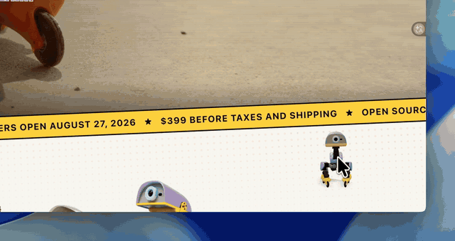

# Duck on Desk

[English](README.md) | 简体中文

一只基于物理引擎的 3D Microduck，常驻你的桌面，实时响应你的 AI 编程 Agent —— Claude Code、Codex CLI、Pi 和 opencode。你提问时它思考，工具运行时它走动，Agent 需要审批时它冲你嘎嘎叫，出错时垂头丧气，你离开时它睡觉。

> AGPL-3.0 衍生自 [Clawd on Desk](https://github.com/rullerzhou-afk/clawd-on-desk)（基线 commit `5ca26b5c`）。这只鸭子由 Pollen Robotics 官方 Microduck 仿真骨架、MuJoCo 物理引擎和强化学习行走策略驱动，不是预制帧动画。详见 `NOTICE.md`。

## 演示

[完整演示（80 秒，MP4，带音乐）](https://github.com/Happenmass/duck-on-desk/releases/latest/download/duck-on-desk-demo.mp4)

## 安装

编译好的程序在 [Releases](https://github.com/Happenmass/duck-on-desk/releases) 页面：

- **macOS**：`Duck-on-Desk-<版本>-arm64.dmg`（Apple Silicon）或 `-x64.dmg`（Intel）。构建未签名，拖进「应用程序」后运行一次：
  `xattr -dr com.apple.quarantine "/Applications/Duck on Desk.app"`
- **Windows**：`Duck-on-Desk-Setup-<版本>-x64.exe` 或 `-arm64.exe`（SmartScreen 提示时选「更多信息 → 仍要运行」）。

鸭子需要的一切都在应用里，包括强化学习策略（来源见 `NOTICE.md`），运行时不下载任何东西。启动应用，打开托盘菜单 → 设置 → Agents，安装 Claude Code、Codex、Pi 或 opencode 的 hooks。

## 开发者模式与训练

在「设置 → 关于」开启「打开开发者模式」，进入独立的 3D 机器人实验室。可操作 14 个关节、编辑奖励和策略网络、执行 PPO 训练、评测、导出 ONNX 并应用到桌宠，支持回退。

Agent 管理页可为 Claude Code、Codex CLI、OpenCode 安装 Robot Lab MCP，让 Coding Agent 查询接口、写脚本和管理训练。行走训练原样嵌入官方 mjlab / microduck_rl 环境（应用会克隆钉死的 commit 并执行 `uv sync`，因此需要 Git）；Apple Silicon 上物理在 CPU、网络在 MPS，NVIDIA 上走 CUDA。MPS 已实测，CUDA 待 NVIDIA 实机验证。第一版训练对象为平地普通脚，详见 [Robot Lab 使用说明](mcp/robot-lab/README.md)。

## 轮滑

托盘菜单的「移动方式」在双脚和官方轮滑形态之间切换：随官方发布的 `BEST_roller`
策略驱动四个被动轮（蹬地、滑行、刹车），`BEST_roller_crouch` 是它的下蹲滑行
把戏，鸭子在原本要啄地的时候就会做一次。两条策略和走路策略一样随应用打包。策略训练时没有转向指令，所以轮滑时的转向是直接旋转身体实现的，
朝向镜头的锥角放宽到 ±80°；轮子上加了一点轴承阻力，让滑行速度适合桌面。轮滑时
不会坐下，自由漫游按真实滚动距离移动窗口。

## 踩高跷（实验）

托盘菜单的「踩高跷」把鸭子换到社区训练的高跷策略
（`HannesVonEssen/microduck-stilts`，训练于 `Vottivott/microduck-playground`）。
它们同样随应用打包（Apache-2.0）。

10–25 cm 是可打印的高度，50 cm–2 m 只是仿真结果。踩高跷时鸭子会走会转，
但不会坐下、啄地或自己爬起（摔倒后直接扶起），并把舵机增益加倍：所有 Microduck 策略都是用 BAM 舵机模型训练的，
官方策略能容忍本模拟器的 MJCF 位置执行器，高跷策略不能。

## Agent 支持
| Agent | 集成方式 | 状态 | 权限气泡 |
|---|---|---|---|
| Claude Code | `~/.claude/settings.json` 中的 command hooks + HTTP `PermissionRequest` hook | 全部 | 有 |
| Codex CLI | `~/.codex/hooks.json` 中的官方 hooks，JSONL 轮询兜底 | 全部 | 有 |
| opencode | `~/.config/opencode/` 中的 plugin | 全部 | 有（桥接） |
| Pi | `~/.pi/agent/extensions/duck-on-desk` 全局 extension | 仅状态 | 无（设计如此） |

## 状态如何驱动鸭子的行为
见 `docs/guides/state-mapping.zh-CN.md`。

## 皮肤
托盘 → Skin：Cream、Graphite、Lavender、Sky（Microduck 官方四种配色）。语音会随皮肤切换。

## 开发
`npm ci && npm run setup:models && npm start`（`setup:models` 会把策略取到你的 Hugging Face 缓存，只需一次） · `npm test` · `npm run build:mac` / `npm run build:win:all`

## 致谢

- [Clawd on Desk](https://github.com/rullerzhou-afk/clawd-on-desk)，作者 rullerzhou-afk 及贡献者（AGPL-3.0）：本项目衍生自它的桌面宠物外壳、Agent 集成、权限气泡和设置系统（基线 commit `5ca26b5c`）。
- [Microduck](https://github.com/pollen-robotics/microduck)，Pollen Robotics（Apache-2.0）：这只小型双足鸭子机器人本身；[microduck_rl](https://github.com/pollen-robotics/microduck_rl)：行走、坐站、啄地和轮滑策略背后的强化学习训练环境；以及 [Microduck 模拟器 Space](https://huggingface.co/spaces/pollen-robotics/microduck-simulator)：本鸭子使用的 3D 骨架、MJCF、语音和策略（3D 素材与语音仅限非商业使用，见 `NOTICE.md`）。
- [microduck-playground](https://github.com/Vottivott/microduck-playground)，Vottivott（Apache-2.0）与 HannesVonEssen 的 [microduck-stilts](https://huggingface.co/HannesVonEssen/microduck-stilts) 权重：社区的高跷训练与策略。
- 迈步与落地的舵机声剪自 gpag1 的 "Small servo (arduino)"（CC0，见 [freesound](https://freesound.org/people/gpag1/sounds/520514/)）；通知音来自 freesound 用户 iut_Paris8（CC0）；Agent 图标来自 [LobeHub Icons](https://lobehub.com/icons)。
- 演示视频的配乐是 Kevin MacLeod（[incompetech.com](https://incompetech.com)）的 "Fluffing a Duck"，[CC BY 4.0](https://creativecommons.org/licenses/by/4.0/) 许可。

## 许可证
代码采用 AGPL-3.0-only 许可。3D 素材与语音库仅限非商业使用（详见 `NOTICE.md`）。
