# 状态映射

[返回 README](../../README.zh-CN.md)

大多数 agent 生命周期事件会映射到同一组 Duck 状态。

Subagent 事件仍映射到逻辑 `juggling` 状态，但 Duck 主题现在会按 live 子代理数量选择分层素材：1 个子代理使用 `duck-headphones-groove.svg`，2 个以上使用 `duck-working-juggling.svg`。旧版 Duck conducting 素材已退役；Calico 和云宝的 2+ 子代理分层仍使用各自的 conducting 动画。

下表的 idle 行描述主题原本的默认行为。用户也可以在“设置 → 动画 / 音效 → 动画”中，从当前主题声明的 idle 视觉里选择一个常驻静置造型。这个选项只改变逻辑状态为 `idle` 时显示的画面；任务、权限、完成、睡眠、互动反应和自由漫步仍会优先覆盖，结束后再回到所选造型。选择按主题分别保存，文件被主题更新删除时会回退到主题默认。非主题默认的 idle 视觉有意不启用鼠标眼球跟随或转圈头晕反应。

| 事件 | 状态 | 动画 | Duck | Calico | 云宝 |
|---|---|---|---|---|---|
| 无活动 | 待机 | 眼球跟踪 |  |  |  |
| 无活动（随机） | 待机 | 看书 / 巡逻 | 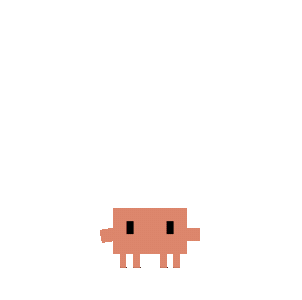 | | 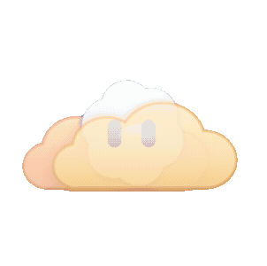 |
| UserPromptSubmit | 思考 | 思考泡泡 + 灵感闪光 |  |  |  |
| PreToolUse / PostToolUse（1 个会话） | 工作（打字） | 打字 |  |  |  |
| PreToolUse / PostToolUse（2 个会话） | 工作（2 会话分层） | 耳机律动 |  |  |  |
| PreToolUse（3+ 会话） | 工作（建造） | 建造 |  |  |  |
| SubagentStart（1 个活跃子代理） | 杂耍 | 耳机律动 |  |  |  |
| SubagentStart（2+ 个活跃子代理） | 杂耍（2+ 分层） | 三球杂耍 |  |  |  |
| PostToolUseFailure | 报错 | 报错 | 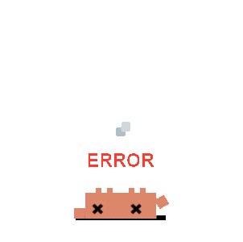 |  |  |
| Stop / PostCompact | 注意 | 开心 | 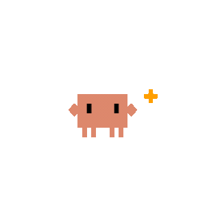 | 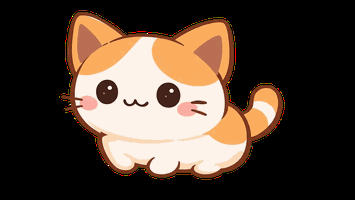 |  |
| PermissionRequest | 通知 | 警报 | 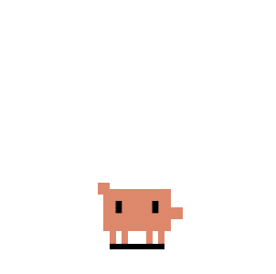 | 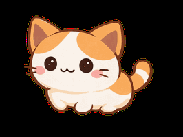 | 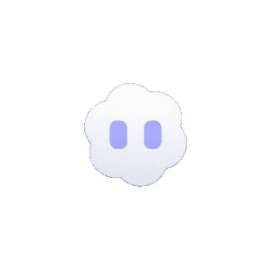 |
| Codex `request_user_input` | 通知 | 警报 + 只读问题卡片 |  |  |  |
| PreCompact | 扫地 | 扫地 | 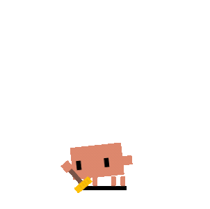 |  | 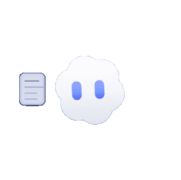 |
| WorktreeCreate | 搬运 | 搬箱子 | 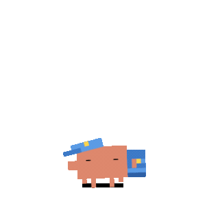 | 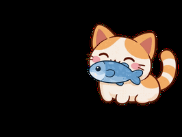 | 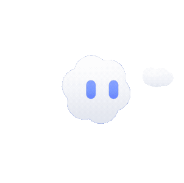 |
| 60 秒鼠标静止 | 睡觉 | 睡眠 | 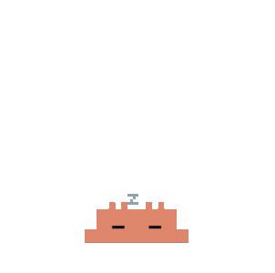 |  | 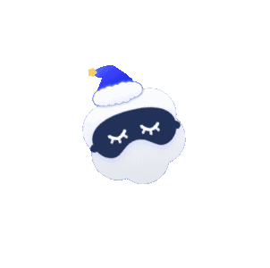 |
| SessionEnd | 删除会话；无其他 live 会话时回到 idle | 不触发睡眠过渡 | | | |

## Pi Extension 事件

Pi 使用全局 extension（`~/.pi/agent/extensions/duck-on-desk`），会把交互式会话生命周期事件映射到 Duck 的共享状态：

| Pi Extension Event | Duck Event | 状态 |
|---|---|---|
| session_start | SessionStart | idle |
| before_agent_start | UserPromptSubmit | thinking |
| tool_call | PreToolUse | working |
| tool_result (ok) | PostToolUse | working |
| tool_result (isError) | PostToolUseFailure | error |
| agent_end | Stop | attention |
| session_before_compact | PreCompact | sweeping |
| session_compact | PostCompact | attention |
| session_shutdown | SessionEnd | 删除会话；无其他 live 会话时回到 idle |

Pi 当前在 Duck 中是 state-only 集成：Duck 不接管权限、不新增确认弹窗，Pi 保持默认 YOLO 执行行为。

## 极简模式

拖到屏幕右边缘（或右键 →"极简模式"）进入——半身露出在屏幕边缘，悬停时探出来。

| 触发 | 极简反应 | Duck | Calico | 云宝 |
|---|---|---|---|---|
| 默认 | 呼吸 + 眨眼 + 眼球追踪 | 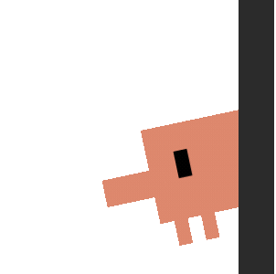 | 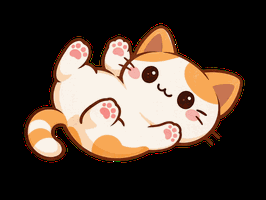 | 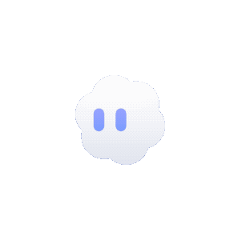 |
| 鼠标悬停 | 探出身体 + 招手 | 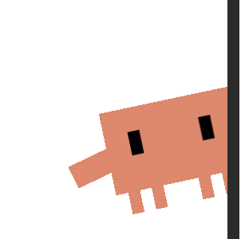 | 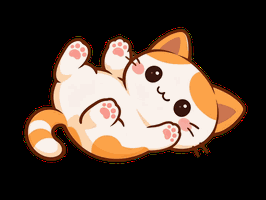 | 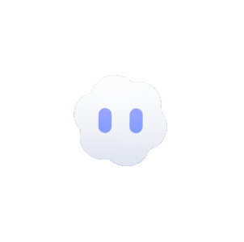 |
| 通知 / 权限请求 | 警报弹出 | 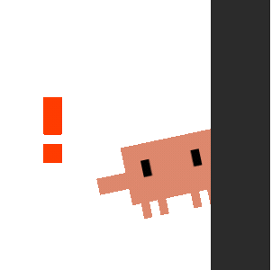 | 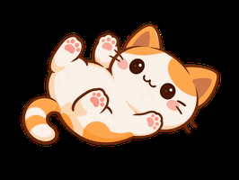 | 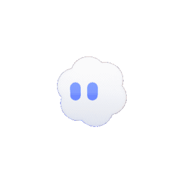 |
| 任务完成 | 开心庆祝 | 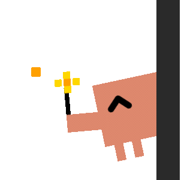 |  | 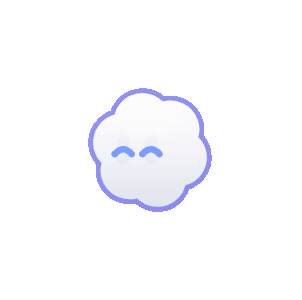 |

## 点击反应

彩蛋——试试双击、连点 4 下、或反复戳 Duck，会有隐藏反应。
