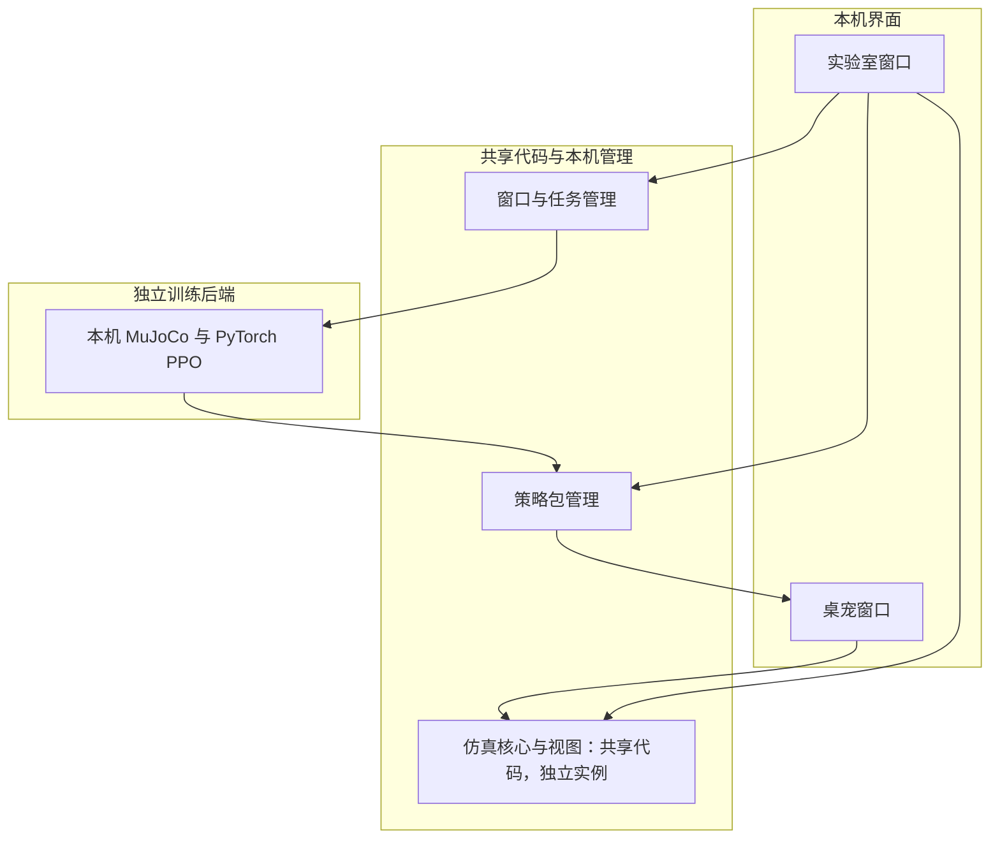
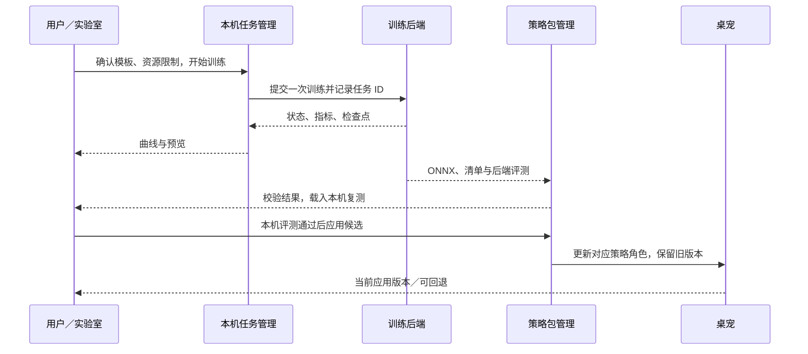

# Robot Lab：机器人实验室顶层架构

状态：首版实现说明 v0.3，2026-09-08。目的：从桌宠进入机器人实验室，完成真实训练、评测、导回桌宠的一次闭环。
需求来源：本次用户明确接受当前性能，要求开发者选项、完整机器人界面／3D 环境，并确认“第一版就跑通训练并导回桌宠”。
首版已实现独立 3D 窗口、真实 CPU MuJoCo＋MPS PPO、双侧评测、ONNX 导出与应用／回退；实测见 diagnostics/robot-lab-mcp-2026-09-08。A1 性能诊断结束；本需求不以前置性能优化为条件。

## 0. 术语

| 词 | 本文含义 | 依据 |
|---|---|---|
| 实验室 | 独立普通窗口内的仿真、训练、评测工作台 | 用户需求 |
| 仿真实例 | 一套独立物理状态、控制器与时间轴 | 运行时现状／本方案 |
| 策略 | 根据观测输出动作的模型，不等同于动作动画 | 现有 ONNX 推理 |
| 训练任务 | 一组固定的目标、奖励、环境和终止条件 | playground tasks |
| 检查点 | 可用于继续训练的训练产物，包含的状态以训练框架为准 | playground 训练／导出 |
| 部署包 | ONNX、兼容性元数据、评测记录的版本化组合 | 本方案新增 |
| 桌宠适配 | 面向屏幕的步幅补偿、朝向限制、居中及会话行为 | 当前桌宠代码 |

## 1. 问题

当前运行时把物理、策略、绘制和桌宠交互写在一起。它每控制步把水平位置归零，普通脚的屏幕移动使用落脚步幅补偿，并有朝向限制与自动恢复。放大窗口并打开阴影不能直接得到可用于训练评测的机器人世界。
实验室提供本机交互与任务管理；批量强化学习由独立训练后端执行。本次只涉及虚拟 Microduck；Reachy 实体接入不属于该功能。

## 2. 目标与本版范围

- G1：开发者入口打开可缩放、不透明、不置顶的独立窗口，操作真实仿真。
- G2：第一版完成一次真实训练并产生可部署策略，不以界面占位或预制曲线验收。
- G3：训练产物在本机复测后，由用户应用到桌宠，并能恢复原策略。
- G4：关闭实验室释放本地仿真、绘制、订阅；训练任务生命周期单独管理。

本版建议先用 Microduck 普通脚、平地速度跟踪跑通训练。用户已要求训练与推理同时考虑 MPS／CUDA，并通过 MCP 查询接口、写奖励脚本与训练策略；CUDA 经用户确认暂标待实机验证。暂不扩展任意场景编辑器、多机器人、实体控制和多家云服务。范围缩小不删掉 G2/G3。

## 3. 系统输入输出

输入：机器人与环境版本、训练配置、版本化奖励／策略脚本、可选训练检查点、用户仿真操作。
处理：本机交互仿真 → 外部训练 → 导出 → 两侧评测 → 用户启用。
输出：训练记录、曲线／预览、版本化策略包、桌宠已应用的版本与回退入口。
绘制中的地面必须与物理碰撞地面一致；仅增加一个 Three.js 地板不算创建训练环境。

## 4. 架构分层

UI 层改动中等；共享仿真边界改动较重；本机任务／策略包管理是新增能力；训练侧复用现有 Python 环境，以 App 当前 chosen_actuator MJCF 实现 CPU MuJoCo 环境，避免把上游 BAM 模型直接视作等价。

## 5. 改造地图

| 模块／资产 | 当前职责 | 变更级别 | 本次范围 |
|---|---|---|---|
| duck-on-desk 设置／窗口管理 | 设置、托盘、宠物和设置窗口 | 修改 | 开发者开关、单实例实验室窗口、打开／关闭生命周期 |
| renderer 实验室入口 | renderer/lab.html、src/lab.js | 已实现 | 3D 视口、机器人参数、训练任务、策略对比与应用 |
| renderer runtime／adapters | 物理、策略、画面、桌宠动作混合 | 修改 | 抽出最小仿真边界；桌宠和世界模式分开；暂停／单步／重置；控制权切换 |
| 本机训练任务管理 | mcp/robot-lab/jobs.cjs | 已实现 | 按模型设备／物理适配器调用训练后端，保存任务 ID，查询／取消／重连，不在主进程执行训练 |
| 本机训练后端 | mcp/robot-lab/training | 已实现 | 共享普通脚执行器与观测契约、PPO 动作修正、结构化指标、检查点及 ONNX；复用 playground Python 环境 |
| 策略目录／pet-model 协议 | 固定策略白名单、全局缓存读取 | 修改 | 注册本地版本化候选包、兼容性检查、启用及回退；保留现有基础策略 |
| 任务记录与兼容性清单 | 尚无实验室记录 | 新增 | 配置、种子、代码／模型版本、任务状态、评测结果与包摘要；权重仍进用户级缓存 |

Agent hook、权限处理、会话聚合仍按原路径工作；实验室无需经过宠物 state-change 桥接来驱动物理。

## 6. 模块职责

| 模块 | 负责 | 不负责 | 入口 → 输出 |
|---|---|---|---|
| 仿真核心与视图 | 本机物理步进、策略推理、关节快照和展示 | 云端学习算法／桌面移窗 | 命令和场景 → 仿真状态 |
| 桌宠适配 | 居中、屏幕步幅、朝向与会话行为 | 训练成绩统计 | 会话意图 → 桌宠行为 |
| 实验室窗口 | 操作、观察、参数表单与任务展示 | 重训练计算／直接运行任意系统命令 | 用户选择 → 有类型的操作 |
| 窗口与任务管理 | 任务提交、状态、取消、重连 | 每个物理步的高频数据搬运 | 训练配置 → 任务记录 |
| 训练后端 | 并行环境、更新权重、检查点、导出和评测 | 本机窗口／桌面状态 | 配置 → 训练产物 |
| 策略包管理 | 校验、版本化缓存、启用与回退 | 替用户认定策略值得采用 | 部署包 → 候选／已应用版本 |

两个界面共用代码，不共用同一个可变仿真实例。实验室中策略控制与手动关节控制互斥。相机画质配置不能顺带改变物理步长或任务语义。

## 7. 已确认与建议区分

| 决策 | 状态 | 内容 |
|---|---|---|
| 当前性能 | 用户已确认 | 可接受，A1 后停止继续优化 |
| 首版交付 | 用户已确认 | 交互仿真、真实训练、导回桌宠都要 |
| 本次执行范围 | 用户已要求首轮 MCP 测试 | 已实现 14 个 MCP 工具、真实 MPS 训练、实验室及桌宠策略应用／回退 |
| 共享代码／独立实例 | 建议 | 不复制两套 runtime，不跨窗口共享同一物理状态 |
| 普通独立窗口 | 建议 | 不透明、可缩放、不置顶 |
| 开窗时的桌宠 | 建议，待定 | 默认暂停并隐藏 Duck 展示；会话状态继续接收，关窗后按最新状态恢复 |
| 首个任务 | 建议，待定 | 普通脚平地速度跟踪，复用现有 Velocity-Flat 任务 |
| 模型后端 | 用户已确认 | 训练／推理均考虑 MPS、CUDA；本机 MPS 探针通过，CUDA 待实机验证 |
| 物理与执行位置 | 设计建议 | Mac 使用 CPU MuJoCo＋MPS 网络；NVIDIA 接入 CUDA 适配器；HF Jobs 仅为可选远程执行器 |

MCP 作为 Coding Agent 入口，复用训练任务管理与策略包管理，不复制另一套任务状态。查询通过 resources／文档工具；写入脚本只创建草稿，执行使用固定版本。当前实现见 `mcp/robot-lab/README.md`。

模型训练设备 `training_device`、模型推理设备 `inference_device`、`physics_backend` 与 `executor` 分开配置。现有桌宠仍是 WASM 推理，MPS／CUDA 推理先在 Python 侧验证；要替换桌宠推理须单独实现本地服务适配与延迟评测，不能把 Web WASM 当作已有原生后端。

## 8. 通信与产物契约

| 通道 | 触发／频率 | 必需内容 | 版本策略 |
|---|---|---|---|
| Coding Agent → MCP → 任务／产物管理 | 按需读写、显式执行 | 文档、脚本、配置、预期 revision、内容摘要、任务标识 | MCP＋实验 schema |
| UI → 本机仿真 | 手动操作；物理步进留在同一 renderer | 控制模式、目标、暂停／单步／重置 | 内部命令契约 |
| 仿真 → UI | 低频快照，建议 10 Hz；不把所有物理步发主进程 | 仿真时间、位姿、关节、接触、当前策略 | 快照版本 |
| UI → 任务管理 → 后端 | 显式开始一次；状态约 1–2 秒刷新，按后端能力调整 | 请求标识、任务模板、配置、种子、资源／时长限制、检查点引用 | 任务配置版本 |
| 后端 → 任务管理 | 进度和阶段变化；预览用录制片段／检查点评测 | 任务 ID、状态、指标、日志位置、产物引用 | 结构化记录版本 |
| UI → 策略包管理 → 桌宠 | 用户应用一次／回退一次 | 不可变包 ID、适用角色、原版本引用 | 部署清单版本 |

部署清单至少描述：机器人／形态、模型摘要、关节顺序、观测布局及归一化、动作缩放与裁剪、控制周期、执行器模型、策略角色和文件摘要。61 维输入／14 维输出相同不足以证明兼容。
现有导出代码已处理归一化与动作裁剪；接入时读取并校验，避免前端再处理一次。

## 9. 首版完整流程

本机复测使用真正的桌宠运行时；不能仅用远端训练奖励认定可部署。

## 10. 故障与关闭行为

| 情况 | 处理 |
|---|---|
| 后端不可用 | 仍可操作本机仿真；训练明确显示不可用，不模拟训练进度 |
| 提交结果不明／网络断开 | 先按请求标识和任务 ID 查询，不盲目重复创建训练 |
| 关闭实验室仍有远端训练 | 明示任务是否继续及仍可能计费；关闭窗口不默默等同于取消远端任务 |
| 本地实验室关闭 | 销毁本地实例和订阅；后台只保留需要的任务记录，重开按 ID 查询 |
| 策略或环境不兼容 | 保留为候选／拒绝应用，说明具体差异；桌宠仍使用旧版本 |
| 新策略运行异常 | 停用候选并恢复旧版本；不覆盖唯一可用基础策略 |

## 11. 验收约束

1. 实验室中的机器人可在世界坐标移动；桌宠的原点归零、屏幕步幅和朝向辅助不污染实验成绩。
2. 暂停停止物理时间；单步恰好推进规定步数；改变视口 FPS 不改变仿真步长。
3. 第一版必须有真实权重更新、检查点、导出的新策略与训练记录；仅启动五步冒烟不等于完成训练目标。
4. 后端与本机用同一组定义明确的测试比较初始／候选策略，记录速度误差、跌倒率等首个任务所需指标；具体阈值在任务规格中确定。
5. 一次候选策略通过本机验证后，可在桌宠实际启用并回退；第一版建议仅替换 walk 角色，坐站／恢复沿用原策略并做动作交接回归。
6. 评测禁止桌宠自动扶起、镜头朝向约束或虚拟步幅掩盖失败；日常桌宠辅助仍可保留。
7. 相同配置不宣称 WASM 与训练引擎逐位一致；BAM 与当前执行器差异必须明确处理或作为部署阻断项，不能继续默认等价。
8. 无运行中的训练时，关闭实验室后不保留其渲染循环、物理循环或任务轮询。远端任务继续运行与“本地窗口关闭”分别说明。

## 12. 首版实施顺序

| 内部里程碑 | 交付与后续规格 |
|---|---|
| 00 MCP 接口验证 | 已有 14 个工具、3 个文档资源；保留合成设备测试，新增真实训练任务和产物工具 |
| 01 闭环验证 | 接真实 CPU MuJoCo 环境＋MPS 训练，预留 CUDA 适配；取得可训练检查点或从头训练；小规模训练→导出→本机加载，暴露兼容性问题 |
| 02 仿真实验室 | 独立窗口、共享核心分界、世界模式、轨道相机、关节／策略控制、暂停和重置 |
| 03 训练与应用 | 模板表单、真实任务状态／曲线、候选评测、桌宠启用／回退、关闭与重连 |

上述各项都是同一个第一版的内部步骤，不把 02 单独当作用户已要求的训练版交付。优先写 01 闭环验证规格，避免先做完整 UI 才发现策略无法导回。

## 13. 待确定

1. 首个训练目标是否采用平地速度跟踪？目标决定奖励、场景与验收标准。
2. 本机真实训练的时间／环境数量预算及可恢复检查点。CUDA 已确定待实机验证；暂不启动 HF Jobs 或付费任务。
3. 开实验室时桌宠是否默认暂停隐藏？这决定控制归属与本地资源占用；方案建议默认暂停。
4. 是否有可用训练检查点？现有 ONNX 是推理产物，不能直接当作 PPO 恢复检查点。本版导入其冻结基础网络，只从头训练残差网络与 critic，保存新的训练检查点；未接入自动续训。

## 14. 依据

- 用户本次原始需求及补充：“两者都要，第一版就跑通训练并导回桌宠”。
- duck-on-desk HEAD `3f64edf5700f681cc5180e5939510f574f737f76`；`docs/project/duck3d-overview.md`。
- `renderer/src/runtime/duck-runtime.js`：加载与控制、takeDisplacement、recenter、恢复、绘制耦合；`motion-leases.js`：控制权优先级。
- `src/robots/duck/pet-model-protocol.js`：当前固定白名单与全局缓存解析；`src/shell/settings-window.js`：现有独立窗口范式。
- 本机 microduck-playground 快照 `c6c0baf4b4db78c6beffa35232bf0d353668018a`：README、pyproject、tasks/__init__.py、microduck_velocity_env_cfg.py、scripts/hf/README.md、scripts/export.py、onnx_policy_contract.py。
- 记忆库 projects/microduck-desktop-pet.md：BAM／桌宠执行器差异及已有高跷迁移记录。

- PyTorch MPS：https://docs.pytorch.org/docs/stable/notes/mps.html
- Warp 后端范围：https://nvidia.github.io/warp/latest/user_guide/faq.html
- HF Jobs：https://huggingface.co/docs/hub/jobs

本轮完成真实 MCP 脚本写入、MPS 训练／推理、ONNX 导出与浏览器评测；证据见 `docs/diagnostics/robot-lab-mcp-2026-09-08/real-training.json` 与 `browser-evaluation.json`。未提交云任务或接触实体。

## 2026-09-08 首版实测与边界

- 界面启动真实 MPS 训练 20 轮、2,560 步；另通过 MCP 写入奖励和策略，独立训练同样步数并实测取消。
- 原生训练／推理均为 MPS，物理为 CPU MuJoCo；ONNX 导出最大误差 2.69e-7。浏览器 MuJoCo 对基础／候选各评测 250 步，无跌倒，速度误差约 0.1483 m/s。短训证明权重更新和导入闭环，不证明行走质量明显提高。
- 仅平地普通脚、walk 角色；非任意场景编辑器、地形课程或 RL 算法平台。CUDA 待 NVIDIA 实机验证。检查点已保存，自动续训尚未接 UI。
- 本机可用 `npm run dev:lab` 独立启动纯虚拟页面；「设置 → 关于」的开发者模式开关提供实验室入口。关闭窗口销毁 renderer，任务由所属 App/MCP 进程管理。
